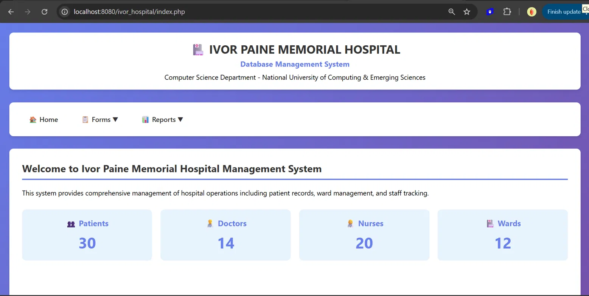
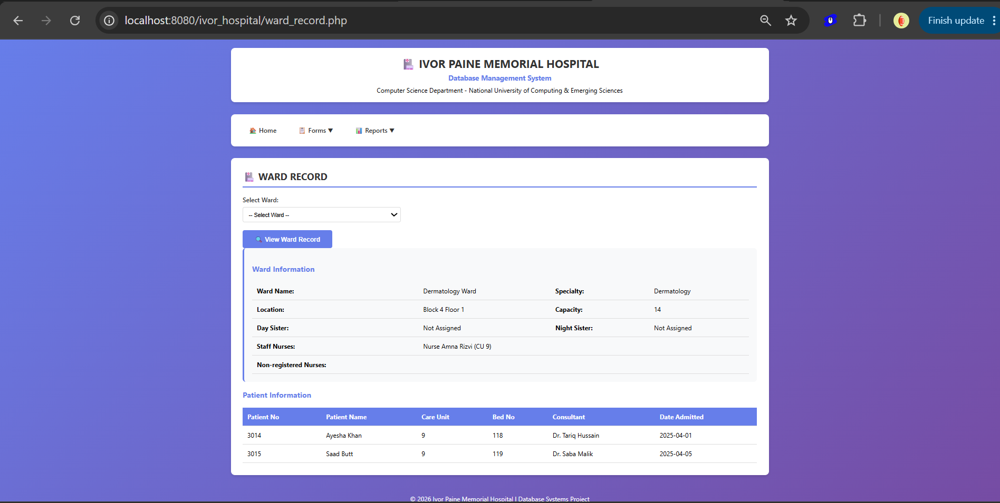
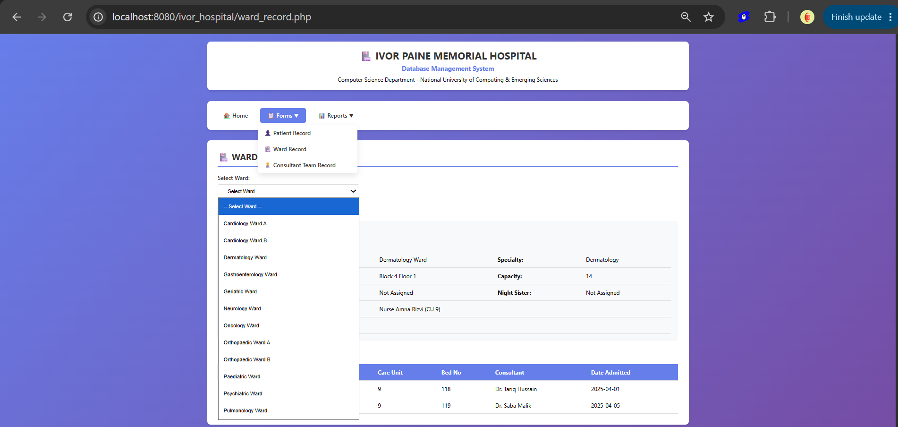
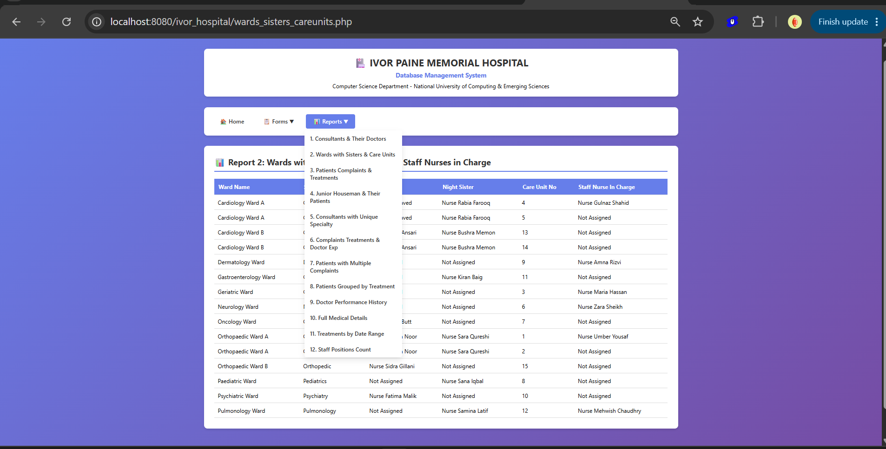

# 🏥 Hospital DBMS Project — Ivor Paine Memorial Hospital

A **PHP and SQL Server** based Hospital Management System developed as a **Database Systems Lab project** at the National University of Computing & Emerging Sciences (FAST-NUCES).

The system provides comprehensive management of hospital operations including patient records, ward management, staff tracking, and report generation — built across 3 milestones covering database design, implementation, and a full web interface.

---

## 📸 Screenshots

### Dashboard


### Ward Record Form


### Forms Navigation


### Reports


---

## 🗂️ Project Structure

```
hospital-dbms-project/
├── database/         # SQL scripts and database setup
├── diagrams/         # ERD and schema diagrams
├── documentation/    # Project documentation and table descriptions
├── screenshots/      # UI screenshots
└── src/              # PHP source code (web application)
```

---

## ⚙️ Tech Stack

| Layer | Technology |
|---|---|
| Backend | PHP |
| Database | Microsoft SQL Server |
| Frontend | HTML, CSS |
| Server | Apache (XAMPP / localhost) |

---

## 🚀 Features

### Forms
- **Patient Record** — View and manage patient details
- **Ward Record** — Select a ward and view full ward info, assigned nurses, and current patients
- **Consultant Team Record** — View consultant and team assignments

### Reports (12 total)
1. Consultants & Their Doctors
2. Wards with Sisters & Care Units
3. Patients Complaints & Treatments
4. Junior Houseman & Their Patients
5. Consultants with Unique Specialty
6. Complaints, Treatments & Doctor Experience
7. Patients with Multiple Complaints
8. Patients Grouped by Treatment
9. Doctor Performance History
10. Full Medical Details
11. Treatments by Date Range
12. Staff Positions Count

---

## 🗄️ Database Design

The database was designed across 3 milestones:

- **Milestone 1** — ERD and schema design (see `diagrams/`)
- **Milestone 2** — SQL Server implementation script (see `database/`)
- **Milestone 3** — PHP web interface with forms and reports (see `src/`)

---

## 🛠️ Setup & Installation

1. Install [XAMPP](https://www.apachefriends.org/) or any PHP + SQL Server environment
2. Clone the repository:
   ```bash
   git clone https://github.com/aj-resp/hospital-dbms-project.git
   ```
3. Run the SQL script from `database/` in SQL Server Management Studio to create and populate the database
4. Copy the `src/` folder contents to your web server's root (e.g. `htdocs/ivor_hospital/`)
5. Update `database.php` with your SQL Server credentials
6. Visit `http://localhost/ivor_hospital/` in your browser

---

## 👥 Team

| Student ID |
|---|
| i240569 |
| i240549 |
| i240668 |

---

## 📄 License

This project is licensed under the MIT License — see the [LICENSE](LICENSE) file for details.
